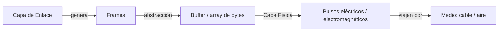
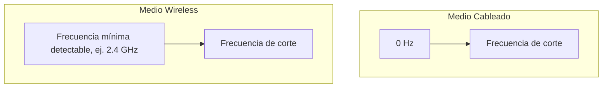
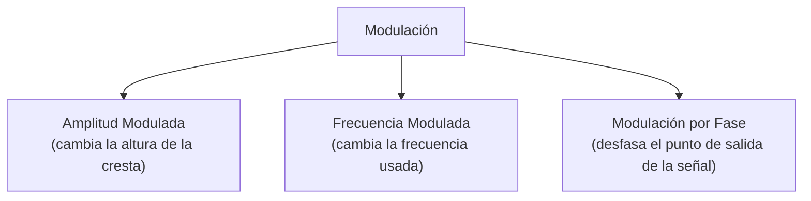
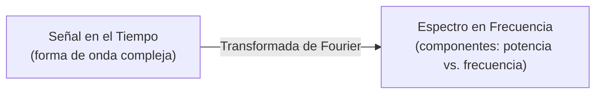
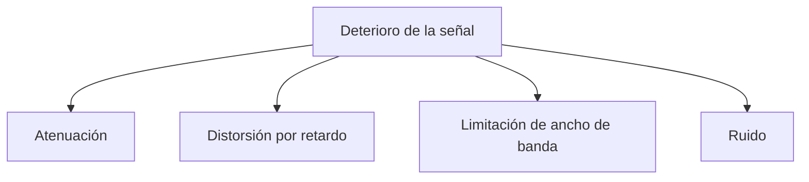
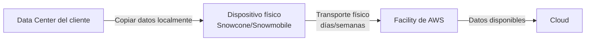

Resumen de Clase 04/09/2026 Redes Emily Sánchez Orozco - 2021067314

# Capa Física (Physical Layer) — Apuntes

> Capas 1 y 2 del modelo OSI son "informativas": rara vez las manipulamos directamente como ingenieros, pero hay que entender cómo funcionan porque explican el comportamiento de todo lo que construimos encima.

## 1. ¿Qué hace la capa física?

- Interactúa directamente con el **hardware** y define el **mecanismo de señalización**.
- **Señalización** = cómo se transforma la información digital (1s y 0s) de la computadora en una forma **analógica** transmisible por un medio físico.
- Define: equipo de hardware, cableado, frecuencia y pulsos usados para representar señales binarias.

| Elemento | Qué significa |
|---|---|
| Hardware | Dispositivos que modulan la señal (antenas, transceivers) |
| Cableado | El medio (incluye wireless, no solo cable físico) |
| Frecuencia | Frecuencia de operación del sistema |
| Pulsos | Espectros usados para enviar la información |

**Relación con la capa de enlace (Data Link):**



---

## 2. Bandwidth (Ancho de banda) — el concepto real

No es el "plan de internet" que vende el ISP. Es una propiedad **física del medio**.

### 2.1 Idea central

Un medio (cable, aire, fibra) permite transmitir señales electromagnéticas en un **rango de frecuencias**. Si mando la misma potencia a distintas frecuencias, **cada frecuencia se degrada (atenúa) a distinta velocidad** al viajar por el medio.

```
Potencia
100% |●─────────────╮
     |               ╲___         <- 400 Hz (se degrada lento)
 70% |....................╲_______
     |                            ╲___
 50% |─ ─ ─ ─ ─ ─ ─ ─ ─ ─ ─ ─ ─ ─ ─ ─●─ ─ ─  <- punto de corte (500 MHz)
     |                                  ╲
     |                                   ╲___  <- 600 MHz (se degrada rápido)
     +----------------------------------------------> distancia (m)
                                    10 m
```

- **Frecuencia de corte**: punto en el que la señal, en condiciones ideales, pierde **más del 50% de su potencia/amplitud** a una distancia de referencia (ej. 10 m).
- **Ancho de banda telemático** = todo el rango de frecuencias **por debajo** de esa frecuencia de corte.

> Ejemplo del profe: medio "Redes01" → ancho de banda = 500 MHz a 10 metros.

### 2.2 ¿Cómo se mide el ancho de banda en un laboratorio?

1. Tomar el medio.
2. Enviar pulsos en distintas frecuencias con **potencia constante**.
3. Medir en qué frecuencia la señal cae más del 50% a una distancia fija.
4. Esa frecuencia = frecuencia de corte → define el ancho de banda del medio a esa distancia.

Si se usa el medio a una distancia mayor a la probada, el comportamiento **ya no está garantizado** (se degrada más rápido). Por eso se instalan **repetidores** cada cierta distancia para reinyectar potencia.

**Mejorar el cable (más armadura / mejor aislamiento):**
- Menor degradación por distancia
- Más ancho de banda
- Se puede cubrir mayor distancia

### 2.3 Medio cableado (wired) vs. inalámbrico (wireless)

| | Wired | Wireless |
|---|---|---|
| Punto de inicio de medición | Desde **0 Hz** hasta la frecuencia de corte | Desde una **frecuencia mínima detectable** hacia arriba |
| Por qué | El cable puede transportar desde muy baja frecuencia | El tamaño de antena necesario para captar frecuencias bajas es enorme (poco práctico) |

**¿Por qué en el aire no se puede empezar desde 0 Hz?**

- A menor frecuencia → mayor **longitud de onda** (la extensión física de una iteración de la señal).
- Para capturar una señal, la antena debe medir aprox. **1/4 de la longitud de onda**.
- Ejemplo: señal con longitud de onda de 1 km → antena de ~150 m. Imposible en una casa.
- Por eso el WiFi doméstico opera desde ~2.4 GHz o 5 GHz hacia arriba: son frecuencias con longitudes de onda pequeñas, captables con antenas de tamaño razonable.



---

## 3. Canales y multiplexión

En vez de asignar **todo** el ancho de banda de un medio a un solo dispositivo (caro y poco eficiente), se **subdivide** en **canales**.

**Analogía del profe:** el ancho de banda del medio es como la carretera San José–Cartago. Los **canales son los carriles**.

```
Ancho de banda total del medio
┌───────────────┬───────────────┬───────────────┬───────────────┐
│   Canal 1     │   Canal 2     │   Canal 3     │   Canal 4     │
│  0–125 MHz    │ 125–150 MHz   │      ...      │      ...      │
└───────────────┴───────────────┴───────────────┴───────────────┘
```

- No todos los canales tienen las **mismas características físicas** → algunos son "premium" (se degradan más lento, permiten repetidores más espaciados, cubren más distancia con menos equipo). Por eso en licitaciones de espectro (ej. 5G) hay rangos de frecuencia más codiciados y caros.

### 3.1 Banda de guarda (guard band)

- Al canal casi nunca se le usa el 100% de su ancho para transmitir.
- Se deja un pequeño margen sin usar en los bordes para **evitar que un canal interfiera con el de al lado** (como no manejar pegado a la orilla del carril).
- Ejemplo: canal de 125 MHz, pero solo se transmiten útilmente 115 MHz, dejando ~5 MHz de desplazamiento como guarda.
- Aplicación real: por eso las estaciones de radio FM no están pegadas (ej. 101.1, luego 101.3), y por eso existían "canales" específicos de TV abierta.

### 3.2 Tipos de multiplexión

| Tipo | Qué hace | Ejemplo |
|---|---|---|
| **Multiplexión por frecuencia (FDM)** | Divide el ancho de banda en sub-canales de distinta frecuencia | Canal grande dividido en sub-canales asignados a distintas personas/empresas (se puede repetir el proceso: multiplexión de multiplexión) |
| **Multiplexión por tiempo (TDM)** | Varios usuarios comparten el mismo canal, turnándose por tiempo | 4 personas usan el mismo canal, 10 segundos cada una |

> En la práctica (ej. WiFi doméstico) se combinan **ambas**: tus dispositivos (laptop, celular, reloj) comparten el mismo canal por **frecuencia y tiempo** a la vez.

Tip práctico: una app "WiFi Analyzer" muestra las redes vecinas, su potencia y el **canal** en el que operan — aplicación directa de estos conceptos.

---

## 4. Transmisión de radio y potencia regulada

- Las radios (broadcast) usan **una antena grande transmisora** y receptores simples del lado del cliente (solo escuchan, no emiten).
- La **potencia de transmisión es regulada por el gobierno** (en Costa Rica, la SUTEL/CANU) — depende de si la frecuencia es de uso nacional o local.
- La cobertura se modela como un **círculo de alcance** alrededor de la antena, pero en la práctica se deforma por obstáculos (edificios, terreno) que degradan la señal más rápido en ciertas direcciones.
- Detección básica en transmisión de un solo sentido: **ausencia de señal = 0, presencia de señal = 1** (hasta que la señal se degrada tanto que ya no se puede reconocer = límite del alcance).

---

## 5. Señales: digital vs. analógica

| | Señal Digital | Señal Analógica |
|---|---|---|
| Forma | Pulso cuadrado | Onda continua (seno) |
| ¿Existe en la naturaleza? | No — es artificial, solo vive dentro de circuitos | Sí — se degrada más lento en el ambiente |
| Uso | Representación interna en computadoras | Transmisión real por un medio (se "modula") |

```
Digital (cuadrada):        Analógica (senoidal):
 __    __    __              _     _     _
|  |  |  |  |  |            / \   / \   / \
|  |__|  |__|  |__          \_/   \_/   \_/
```

**¿Por qué no se envía la onda cuadrada directamente por el medio?**
Una onda cuadrada es en realidad la **suma de muchos componentes de frecuencia** (armónicos). Como no todos viajan a la misma velocidad ni se degradan igual, la forma cuadrada se destruye rápidamente en el medio. Por eso se usan senos/cosenos (señales analógicas) como portadoras, y se **modulan** para representar la información digital.

### 5.1 Características físicas de una onda

```
        Amplitud
          ↑
          |    ___          ___
          |   /   \        /   \
   -------+--/-----\------/-----\------→ tiempo
          | /       \    /       \
          |/         \__/         \__
          |
       <--- Periodo (T) --->
       <-- Longitud de onda (λ) -->
```

| Término | Definición |
|---|---|
| **Oscilación** | Movimiento periódico entre dos puntos |
| **Amplitud** | Altura máxima de la onda (desde el eje hasta la cresta); se relaciona con la **potencia de transmisión** |
| **Frecuencia (f)** | Número de ciclos por unidad de tiempo |
| **Longitud de onda (λ)** | Distancia entre dos puntos máximos consecutivos; determina el **tamaño de antena** necesario |
| **Periodo** | Tiempo que tarda en completarse un ciclo |
| **Ciclo de oscilación** | Recorrido completo desde el inicio hasta volver a la posición inicial |
| **Fase** | Relación entre dos señales de igual frecuencia/longitud pero que no están alineadas (desfasadas) |

---

## 6. Modulación — cómo se codifica información en una onda analógica

Se modifica **una característica física** de la onda para representar símbolos.



| Tipo | Cómo representa símbolos | Limitación |
|---|---|---|
| **Amplitud Modulada (AM)** | Ej: 0 = ausencia de amplitud, 1 = presencia. Se pueden crear más niveles (ej. medio metro = 1, un metro = 2...) | Muy sensible a interferencia — la amplitud se degrada fácil con obstáculos, por lo que se necesitan receptores más exactos |
| **Frecuencia Modulada (FM)** | Ej: 400 MHz = 0, 500 MHz = 1 | Para más símbolos se necesitan más frecuencias distintas |
| **Fase (PM)** | Ej: 0° = símbolo 0, 15° = símbolo 1, 30° = símbolo 2, 45° = símbolo 3... | Permite representar **muchos símbolos con una sola frecuencia**, desfasando la señal |

```
Fase (representación por cuadrantes):

        90°
         |
 0°------+------180°
         |
        270°

  0° → símbolo 0
  15° → símbolo 1
  30° → símbolo 2
  45° → símbolo 3
```

### 6.1 ¿Por qué importa la fase?

- Con binario puro (2 símbolos: 0/1), representar un carácter necesita muchos bits.
- Si en vez de 2 símbolos el sistema logra distinguir **más símbolos por desfase**, se puede representar **más información con menos bits**.
- Esto **no cambia el ancho de banda físico** (los Hz que pasan por segundo siguen siendo los mismos), pero **sí aumenta el rendimiento efectivo del enlace** (más datos útiles por segundo).
- Técnica real: **modulación ortogonal**, usada en telefonía celular. Es costosa de implementar (antenas/dispositivos más caros y de desarrollo lento), por eso no se usó desde el inicio.
-  La fase **no aplica a fibra óptica** porque la fibra no transmite ondas electromagnéticas sino **pulsos de luz** — solo aplica a medios cableados eléctricos.

---

## 7. Análisis de Fourier: dominio del tiempo → dominio de la frecuencia

- Toda señal periódica se puede descomponer en una **suma de senos y cosenos** (componentes sinusoidales / armónicos).
- El análisis de Fourier convierte una señal del **dominio del tiempo** (difícil de manejar) al **dominio de la frecuencia** (más simple de analizar).



- **Fundamental (1er armónico)**: el componente que **le da la forma principal** a la señal.
- **Armónicos superiores**: complementan y afinan la forma para acercarse a la señal deseada (ej. una onda cuadrada necesita muchos armónicos sumados para verse "cuadrada").
- Cuantos más armónicos se logran transmitir sin pérdida, más fiel es la señal recibida a la original.

```
Pulso cuadrado real  ≈  suma de:

 Fundamental:     ∿∿∿   (le da la forma base)
   + armónico 3:  ~     (afina bordes)
   + armónico 5:  ~     (afina más)
   + ... (hasta 15 armónicos en el ejemplo del profe)
        ↓
   forma final más parecida al cuadrado
```

---

## 8. Banda base vs. Pasabanda

| Concepto | Definición |
|---|---|
| **Banda base (baseband)** | Medios que transmiten desde **0 Hz** hasta la frecuencia de corte (típico en medios cableados) |
| **Pasabanda (passband)** | El ancho de banda se mide a partir de una **frecuencia mínima capturable** por el hardware disponible (típico en wireless) |

---

## 9. Deterioro de la señal



| Fenómeno | Descripción |
|---|---|
| **Atenuación** | Pérdida de energía por fricción al viajar por el medio. Se degrada de forma **logarítmica** con la distancia (predecible). |
| **Distorsión por retardo** | No todos los componentes de frecuencia viajan a la misma velocidad → aunque salgan juntos, no llegan juntos (analogía: carros que salen juntos pero van a distinta velocidad). |
| **Limitación de ancho de banda** | El sistema (ej. un micrófono) no logra capturar/transmitir todos los armónicos necesarios → se pierden componentes de frecuencia (por eso no nos gusta oír nuestra voz grabada). |
| **Ruido** | Térmico o interferencia electromagnética de otras señales presentes en el ambiente (otros dispositivos, access points vecinos, etc.) |

 **Wireless es especialmente vulnerable**: no hay armadura/blindaje para la señal en el aire, viaja en todas direcciones y puede chocar con otras señales. El profe menciona que wireless puede llegar a **perder hasta un 50%** de la información enviada — por eso prefiere medios cableados (ej. audífonos con cable) cuando la confiabilidad importa.

---

## 10. Curiosidad: SETI y comunicación extraterrestre

- Cualquier civilización avanzada que se comunique debe **manipular el espectro electromagnético** y generar **patrones** detectables (a diferencia del ruido natural aleatorio).
- Las ondas de **onda larga** son las que logran escapar de la atmósfera terrestre (otras rebotan en la ionósfera o siguen la curvatura de la Tierra).
- En el vacío del espacio, una onda **no se degrada** (no hay fricción), por lo que puede viajar indefinidamente.
- El **proyecto SETI** consiste en antenas escuchando el espacio, buscando patrones en señales de onda larga que indiquen inteligencia. (Antiguamente existía un programa que usaba el tiempo ocioso de las computadoras personales para ayudar a procesar estas señales.)

---

## 11. Medios de transmisión guiados: medios magnéticos

Un medio de transmisión no tiene que ser "en línea" — se caracteriza por **cuánto ancho de banda (dato) puede mover** y **en cuánto tiempo/distancia**.

- Históricamente: **"Sneakernet"** — mover información caminando con un diskette entre computadoras (el medio era literalmente la persona).
- Hoy en día, para **volúmenes masivos de datos**, mover información por internet puede no ser viable.

**Ejemplo numérico del profe:**
- Conexión de 1000 Mbps (megabits) ≈ 125 MB/s reales.
- Mover una cantidad enorme de datos (ej. cientos de TB/PB) por esa conexión puede tardar **meses**.
- Solución: **transporte físico de discos**.

### Servicios reales (familia AWS Snow)

| Dispositivo | Uso |
|---|---|
| **AWS Snowcone** | Dispositivo pequeño para mover cantidades moderadas de datos |
| **AWS Snowmobile** | Tráiler completo, mueve hasta **100 petabytes**, incluye cómputo (servidores) y conexión satelital — permite mantener una aplicación funcionando *mientras* se transporta la data |

**Cómo se caracteriza este "medio":**
- **Delay (latencia) muy alto**: desde que se copia el primer bit hasta que está disponible en destino puede tardar días/semanas.
- **Throughput (capacidad de transferencia) muy alto**: se mueve todo de una sola vez físicamente.



> Conclusión clave: existe una cantidad enorme de empresas con datos masivos que **no pueden procesar** simplemente porque no tienen forma eficiente de moverlos a donde está el poder de cómputo — de ahí que servicios como este tengan sentido comercial.

---

